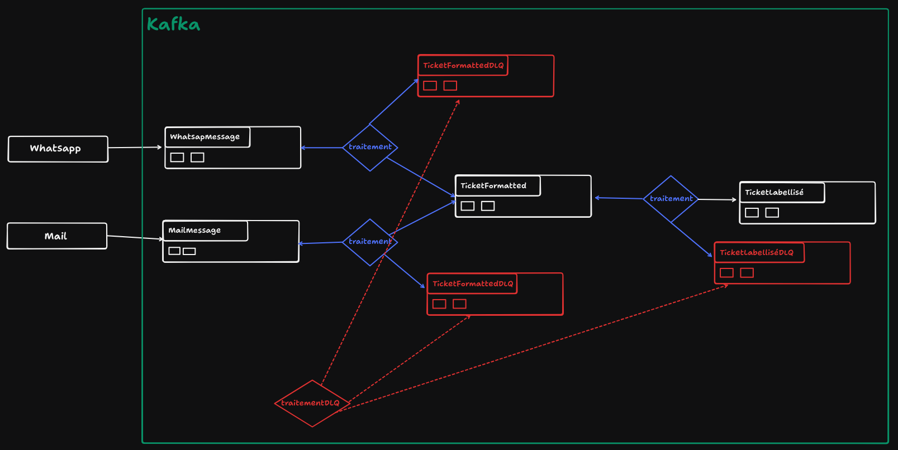

# Signal Broker

[](https://openjdk.org/)
[](https://spring.io/projects/spring-boot)
[](https://www.typescriptlang.org/)
[](https://react.dev/)
[](https://www.docker.com/)
[](https://kafka.apache.org/)

## Description

Signal Broker is a comprehensive support ticket management system designed for technical support teams.

It offers a complete solution for real-time management, tracking, and analysis of support requests. It utilizes AI for automatic ticket classification and provides a robust dashboard for monitoring KPIs in real-time.

### Core Principles

- **Automatic Labeling**: Intelligent classification of tickets using AI (Ollama).
- **Ticket Grouping**: Related tickets are grouped together on the fly via AI similarity checks.
- **Dashboard & KPIs**: Real-time visualization of key performance metrics.
- **Alerting**: Instant notifications via Discord and other channels for critical events.
- **Internal Discussion**: Dedicated communication threads for team members on each ticket.
- **Event-Driven Architecture**: Built around Apache Kafka for scalability and real-time processing.
- **Long-term Storage**: Integration with Garage (S3 compatible) via Kafka Connect to archive raw tickets in a Data Lake.



## Getting Started

The application is divided into 2 main parts: **backend** and **frontend**.

### Prerequisites

- Java 21
- Node.js 20+
- Docker & Docker Compose

## Running

### Locally (development mode)

**Backend:**
```bash
cd backend
./mvnw spring-boot:run
```

**Frontend:**
```bash
cd frontend
npm install
npm run dev
```

Then go to:
- Frontend: http://localhost:5173
- Backend API: http://localhost:8080

### Locally (fully dockerized)

```bash
docker compose up -d --build
```

Then go to:
- Frontend: http://localhost:80
- Backend API: http://localhost:8080
- Kafbat UI (Kafka Management): http://localhost:8082

To stop the application:
```bash
docker compose down
```

Use `-v` if you want to remove volumes too.

## Code Quality

For code quality, we use:
- **Backend**: Spotless with Google Java Format
- **Frontend**: ESLint and Prettier

### Commands

**Backend:**
```bash
cd backend
./mvnw spotless:check  # Check formatting
./mvnw spotless:apply  # Fix formatting
```

**Frontend:**
```bash
cd frontend
npm run lint          # Check linting
npm run format:check  # Check formatting
npm run format        # Fix formatting
```

> **Warning**: Those are mandatory before pushing code, if it is not done the CI will fail.

## Repository

Notre repo GitHub : https://github.com/axelfrache/signal-broker